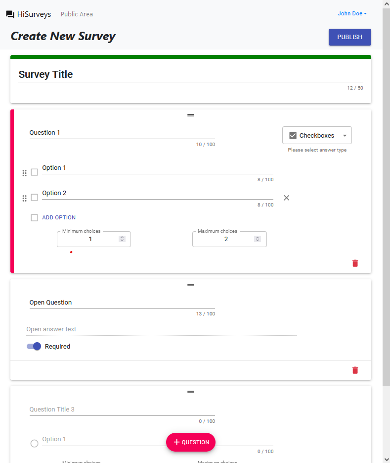

# Exam #1: "Survey"
## Student: ONICA ALEXANDRU VALENTIN

## React Client Application Routes

- Route `/`: displays all published surveys, allowing any user to take them.
- Route `/takeSurvey/:sId`: form in which an user can take a survey, sId is the survey id
- Route `/login`: login page
- Route `/admin`: admin dashboard, in which he can view his survey list and access previews and responses
- Route `/admin/createSurvey`: form that allows the creation of a survey
- Route `/admin/survey/:sId/answer/`: answers display page, with paged strategy
- Route _other_: 404 page with redirect to homepage

## API Server

- GET `/api/getSurveys/`
  - responds with the published surveys
- GET `/api/survey/:sId/header`
  - sId in [_'my', 'all', /\d+/_] gets surveys headers of the authenticated user
  - the surveys headers (the authenticated user gets to know the number of responses to his surveys)
- POST `/api/sessions`
  - email and password for user authentication
  - {id, email, name} of the user 
- GET `/api/sessions/current`
  - {id, email, name} of the authenticated user
- DELETE `/api/sessions/current`
  - logout
- GET `/api/getSurvey/:sId/questions`  
  - sId of the survey
  - public information related to the survey header and its questions
- POST `/api/insertSurvey`
  - newly created survey data
  - new survey id
- POST `/api/insertAnswer`
  - newly created answer
  - new answer id
- GET `/api/survey/:sId/questions`
  - sId of the survey with authentication
  - survey's questions
- GET `/api/survey/:sId/answers/:start?`
  - sId of the survey and start index of the answers
  - maximum 5 answers for each call starting from that index
  
## Database Tables

- Table `users` - contains id email password name
- Table `surveys` - contains id title responses uId published added(unused) nQuestions
- Table `questions` - contains sId id title required options(null | {min,max,values}) idx(unused)
- Table `aToQ` - contains aId sid name timestamp
- Table `answers` - contains id qid content( when open => string | when radio => number | when check => array)

## Main React Components

- `AppBar` (in `AppBar.js`): AppBar used for navigation to homepage and login
- `AuthProvider` (in `AuthContext.js`): keeps authentication information
- `PageNotFound` (in `PageNotFound.js`): 404 page
- `SurveysList` `NoAuthCard` (in `components/headerDisplay/`): used to display Survey Cards on the homepage
- `SurveyFrom` `QuestionCard` `NameCard` (in `components/compilation/`): used to display the form for taking a survey
- `AdminSurveys` (in `components/admin/AdminSurveys.js`): listing the surveys belonging to the administrator
- `AnswerDisplay` (in `components/admin/AnswerDisplay.js`): listing the answers to a specific survey
- `SurveyDisplay` (in `components/admin/SurveyDisplay.js`): for previewing and showing the answers to a survey
- `TitleCardEdit` `QuestionCard` `OptionsRender` `SurveyCreation` (in `components/admin/creation/`): all components necessary to render the creation form

## Screenshot

## Users Credentials

- john.doe@polito.it, password
- mario.rossi@polito.it, password
